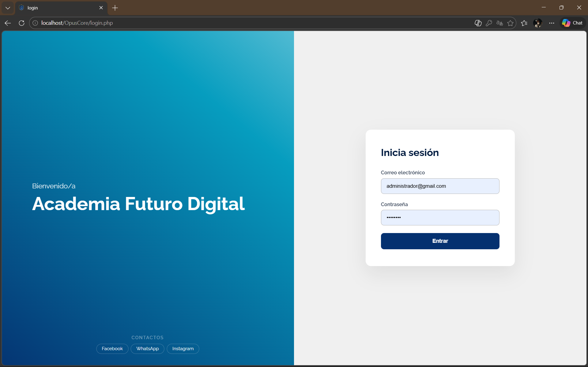
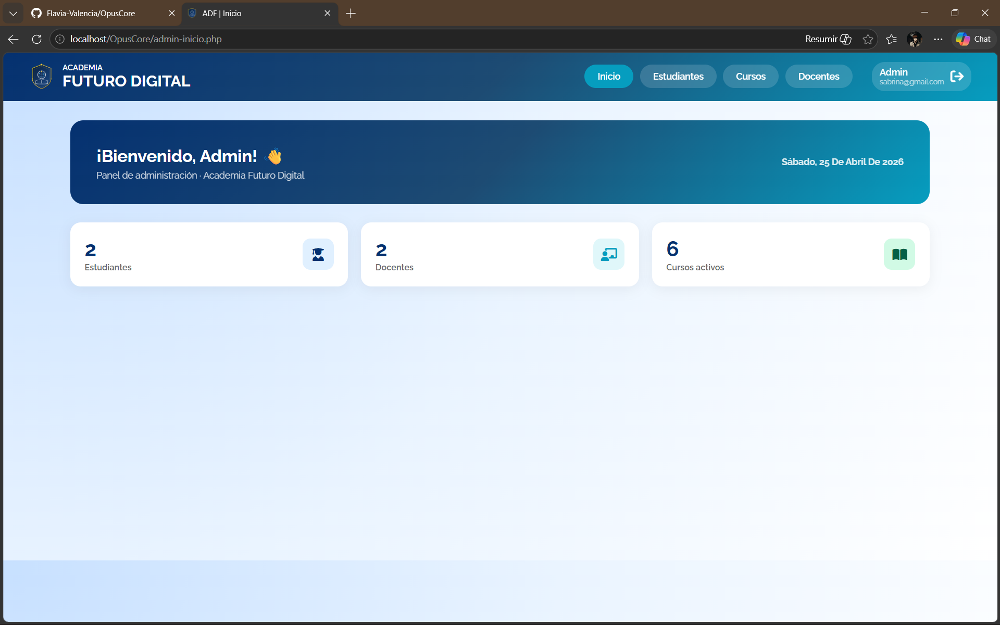
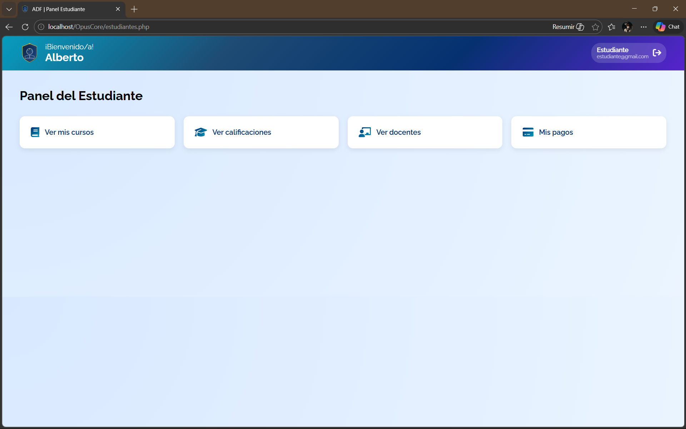
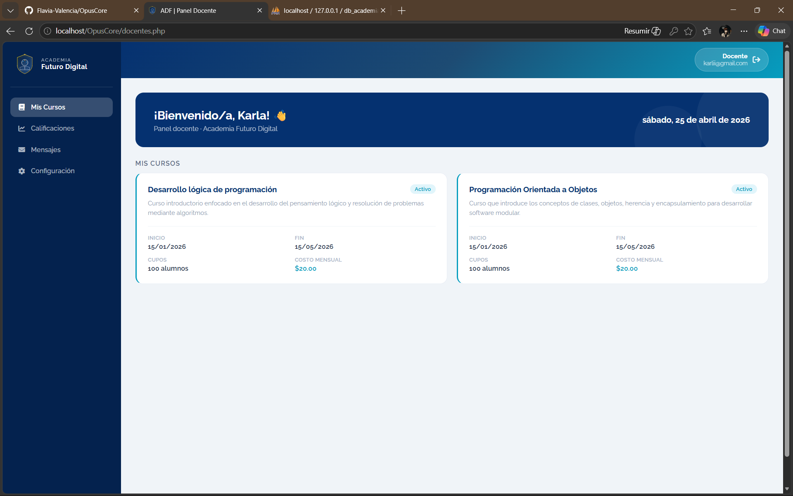

# 📚 Sistema para Academia Futuro Digital
El proyecto consiste en el desarrollo de una Aplicacion web para una academia, con el objetivo de optimizar procesos internos como: 
- Inscripcion de estudiantes
- Gestión de notas 
- Pagos en línea

El sistema permitira el ingreso de distintos roles: 
- Administrador 
- Docente
- Estudiante 

## Objetivo 
Diseñar un sistema que solucione las dificultades actuales en el ingreso de notas, emisión de constancias, inscripciones y facturación, mediante la automatización y centralización de los procesos académicos

## Tecnologías a utilizar
- PHP/HTML -> Lógica y estructura del sistema
- JS -> Interactividad 
- CSS -> Diseño visual
- MySQL -> Base de Datos
- XAMMP -> Entorno de desarrollo local

## Instalación y Ejecución
Pasos detallados para instalar y ejecutar el proyecto en un entorno local.

#### 1. Clonar el repositorio:
En la terminal de Visual Studio Code ejecutar:
git clone https://github.com/Flavia-Valencia/OpusCore.git

#### 2. Iniciar el servidor local:
Instalar XAMMP luego abrirlo y activar los siguientes servicios:
- Apache
- MySQL

#### 3. Mover la carpeta del proyecto a la siguiente ruta:
C:\xampp\htdocs\

#### 4. Configurar la base de datos:
- Ingresar a: http://localhost/phpmyadmin/
- Crear una nueva base de datos, con el siguiente nombre: db_academiadigital
- Importar desde el repositorio OpusCore el script de la base de datos:
    db_academiadigital.sql
  
#### 5. Ejecutar el sistema:
Abrir el navegador y acceder a:
http://localhost/OpusCore/login.php

#### 6. Credenciales del Sistema:
##### Administrador
- **Correo:** sabrina@gmail.com
- **Contraseña:** SabriAdmin-12

##### Docente
- **Correo:** karli@gmail.com
- **Contraseña:** KarliDocente_22

##### Estudiante
- **Correo:** Yamii@gmail.com
- **Contraseña:** YamiEstudiante-19

## Equipo Responsable
En caso de dudas con la instalación, contactar a:
- **Nombre:** Flavia Valencia
- **Correo:** [u20240609@univo.edu.sv](mailto:u20240731@univo.edu.sv)
- **Nombre:** Yahir  Romero
- **Correo:** [u20240873@univo.edu.sv](mailto:u20240873@univo.edu.sv)
- **Nombre:** Emely Muñoz
- **Correo:** [u20240878@univo.edu.sv](mailto:u20240878@univo.edu.sv)

##  Evidencias del Proyecto

### 🔐 Pantalla de Login

### 👨‍💼 Panel Administrador

### 🎓 Panel Estudiante

### 👩‍🏫 Panel Docente

## Version del Sistema
v0.2 – Sprint 2

## Autor(es)
OpusCore - Equipo de Desarollo

