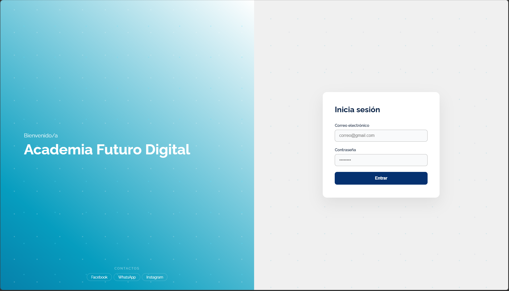
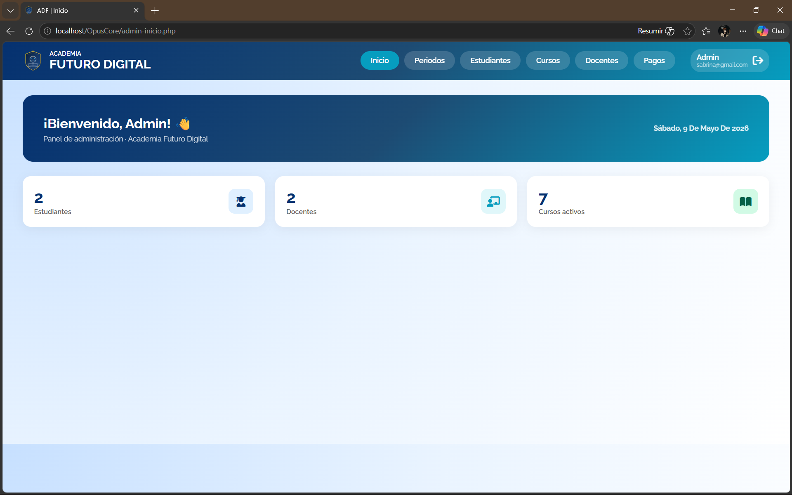
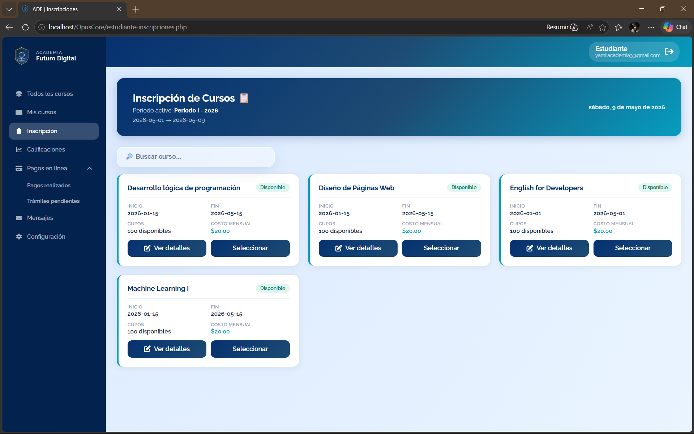
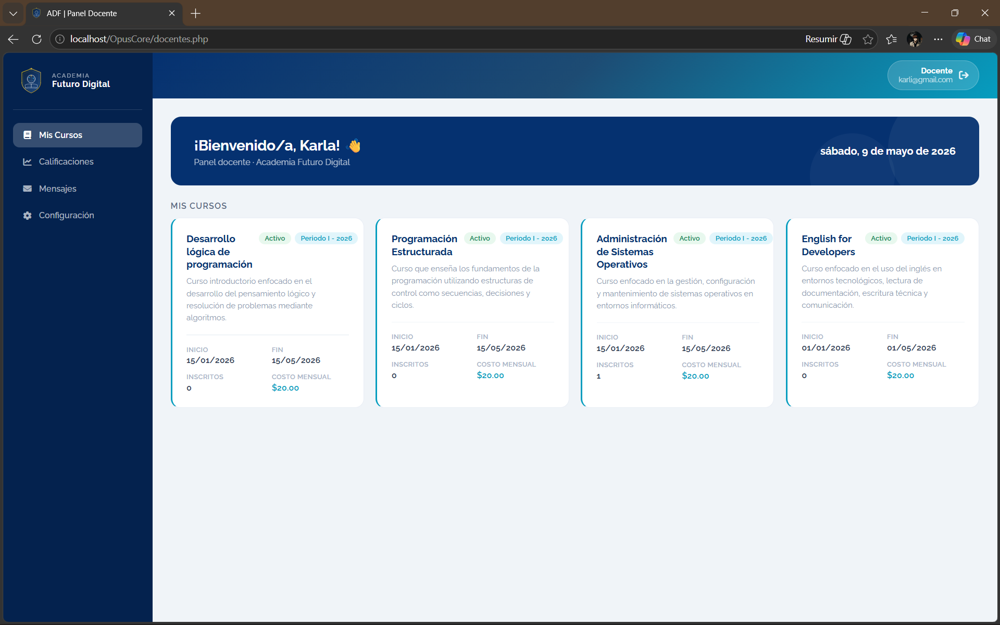

# 📚 Sistema para Academia Futuro Digital
El proyecto consiste en el desarrollo de una Aplicacion web para una academia, con el objetivo de optimizar procesos internos como: 
- Inscripcion de estudiantes
- Gestión de notas 
- Pagos en línea

El sistema permitira el ingreso de distintos roles: 
- Administrador 
- Docente
- Estudiante 

## Objetivo 
Diseñar un sistema que solucione las dificultades actuales en el ingreso de notas, emisión de constancias, inscripciones y facturación, mediante la automatización y centralización de los procesos académicos

## Tecnologías a utilizar
- PHP/HTML -> Lógica y estructura del sistema
- JS -> Interactividad 
- CSS -> Diseño visual
- MySQL -> Base de Datos
- XAMMP -> Entorno de desarrollo local
- DomPDF -> Generación de archivos PDF
- PHPMailer -> Envío de correos electrónicos
- PayPal Sandbox (Developer Dashboard) -> Simulación de pagos en línea

## Instalación y Ejecución
Pasos detallados para instalar y ejecutar el proyecto en un entorno local.

#### 1. Clonar el repositorio:
En la terminal de Visual Studio Code ejecutar:
git clone https://github.com/Flavia-Valencia/OpusCore.git

#### 2. Iniciar el servidor local:
Instalar XAMMP luego abrirlo y activar los siguientes servicios:
- Apache
- MySQL

#### 3. Mover la carpeta del proyecto a la siguiente ruta:
C:\xampp\htdocs\

#### 4. Configurar la base de datos:
- Ingresar a: http://localhost/phpmyadmin/
- Crear una nueva base de datos, con el siguiente nombre: db_academiadigital
- Importar desde el repositorio OpusCore el script de la base de datos:
    db_academiadigital.sql
  
#### 5. Ejecutar el sistema:
Abrir el navegador y acceder a:
http://localhost/OpusCore/login.php

#### 6. Credenciales del Sistema:
##### Administrador
- **Correo:** sabrina@gmail.com
- **Contraseña:** SabriAdmin-12

##### Docente
- **Correo:** karli@gmail.com
- **Contraseña:** KarliDocente_22

##### Estudiante
- **Correo:** yamiiacademia3@gmail.com
- **Contraseña:** YamiEstudiante-19

#### Correo para verificación de comprobantes
- **Cuenta Gmail:** yamiiacademia3@gmail.com

> Esta cuenta se utiliza para recibir y verificar comprobantes de pago enviados automáticamente por el sistema durante las pruebas de pagos en línea.

#### Cuenta institucional de la academia
- **Correo:** academiafuturodigital6@gmail.com
- **Contraseña:** AcademiaFuturoDigital!3

> Utilizada para pruebas de correos automáticos y recepción de comprobantes del sistema.

## 💳 Credenciales de Prueba — PayPal Sandbox

#### Cuenta PayPal Sandbox (comprador)
- **Correo:** sb-83pij50925673@personal.example.com
- **Contraseña:** ,>g/U#3f

#### Tarjeta Mastercard de prueba
- **Número:** 5110 9212 6151 6739
- **Fecha de vencimiento:** 05/31
- **CVV:** cualquier 3 dígitos (ej. 123)
- **Nombre:** Yammi
- **Apellidos:** Doe
- **Dirección:** El salvador
- **Código postal:** 1111
- **Ciudad:** Santiago de maria
- **Departamento:** Usulután
- **Móvil:** +503 2442 9627
- **Correo:** sb-dsspy50997240@personal.example.com

#### Tarjeta Visa de prueba
- **Número:** 4032 0312 6508 1702
- **Fecha de vencimiento:** 05/2031
- **CVV:** cualquier 3 dígitos (ej. 123)
- **Nombre:** Yammi
- **Apellidos:** Doe
- **Dirección:** El salvador
- **Código postal:** 1111
- **Ciudad:** Santiago de maria
- **Departamento:** Usulután
- **Móvil:** +503 2442 9627
- **Correo:** sb-dsspy50997240@personal.example.com

> ⚠️ Estas credenciales son solo para pruebas en modo sandbox. No usar en producción.

## Equipo Responsable
En caso de dudas con la instalación, contactar a:
- **Nombre:** Flavia Valencia
- **Correo:** [u20240609@univo.edu.sv](mailto:u20240731@univo.edu.sv)
- **Nombre:** Yahir  Romero
- **Correo:** [u20240873@univo.edu.sv](mailto:u20240873@univo.edu.sv)
- **Nombre:** Emely Muñoz
- **Correo:** [u20240878@univo.edu.sv](mailto:u20240878@univo.edu.sv)

##  Evidencias del Proyecto

### 🔐 Pantalla de Login

### 👨‍💼 Panel Administrador

### 🎓 Panel Estudiante

### 👩‍🏫 Panel Docente

## Version del Sistema
v0.3 – Sprint 3

## Autor(es)
OpusCore - Equipo de Desarollo

